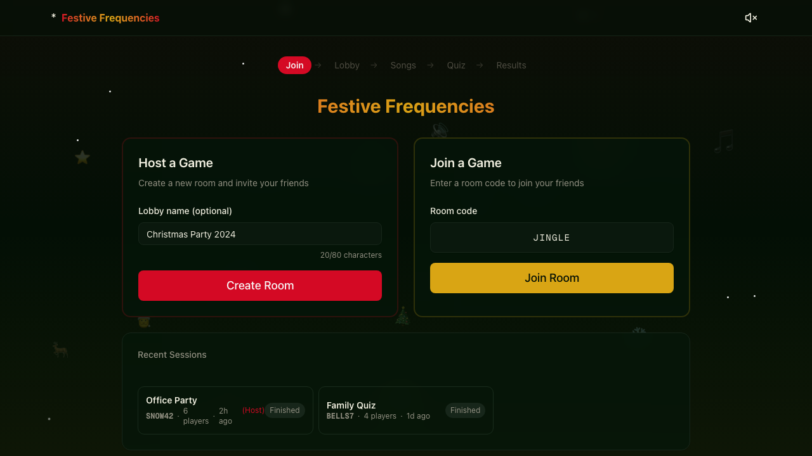
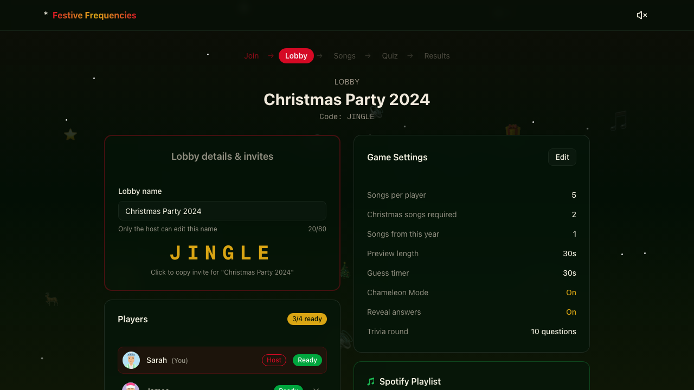

# Festive Frequencies

A multiplayer music quiz game where friends submit their favourite songs, then guess who picked what. Built with Next.js, Supabase, and the Spotify API.

## Screenshots

<p align="center">
  
</p>

<p align="center">
  
</p>

<p align="center">
  
</p>

## How It Works

1. **Create or Join a Room** - The host creates a room and shares the code with friends
2. **Pick Your Songs** - Everyone searches Spotify and selects songs that represent their taste
3. **Guess Who** - Songs are played in random order and everyone guesses who picked each one
4. **See the Results** - Points are awarded for correct guesses and the winner is revealed

## Features

- **Spotify Integration** - Search and play previews directly from Spotify
- **Real-time Multiplayer** - See other players join and submit in real-time
- **Chameleon Mode** - Pick one song disguised as someone else's taste for bonus points
- **Christmas Mode** - Require festive songs for holiday parties
- **AI Summaries** - Get a fun personality summary based on your song picks
- **Trivia Rounds** - Optional music trivia questions between guessing rounds

## Tech Stack

- **Frontend**: Next.js 15 (App Router), React 19, Tailwind CSS
- **Backend**: Supabase (PostgreSQL, Auth, Realtime)
- **APIs**: Spotify Web API, Google Gemini AI
- **Testing**: Playwright for automated screenshots

## Getting Started

### Prerequisites

- Node.js 20+
- A Supabase project
- Spotify Developer credentials
- Google Gemini API key (optional, for AI features)

### Environment Variables

Create a `.env.local` file with:

```bash
# Supabase
NEXT_PUBLIC_SUPABASE_URL=your_supabase_url
NEXT_PUBLIC_SUPABASE_ANON_KEY=your_supabase_anon_key

# Spotify
SPOTIFY_CLIENT_ID=your_spotify_client_id
SPOTIFY_CLIENT_SECRET=your_spotify_client_secret

# Google Gemini (optional)
GOOGLE_GEMINI_API_KEY=your_gemini_api_key
```

### Installation

```bash
# Install dependencies
npm install

# Run the development server
npm run dev
```

Open [http://localhost:3000](http://localhost:3000) in your browser.

## Scripts

| Command | Description |
|---------|-------------|
| `npm run dev` | Start development server |
| `npm run build` | Build for production |
| `npm run start` | Start production server |
| `npm run lint` | Run ESLint |
| `npm run test` | Run Playwright tests |
| `npm run screenshots` | Generate screenshots from demo pages |

## Demo Pages

Demo pages are available at `/demo/*` for testing and screenshot generation:

- `/demo/home` - Home/join screen
- `/demo/lobby` - Game lobby with players
- `/demo/submission` - Song selection interface

## Deployment

The app is designed to be deployed on Vercel. Connect your repository and add the environment variables in the Vercel dashboard.

## Licence

MIT
